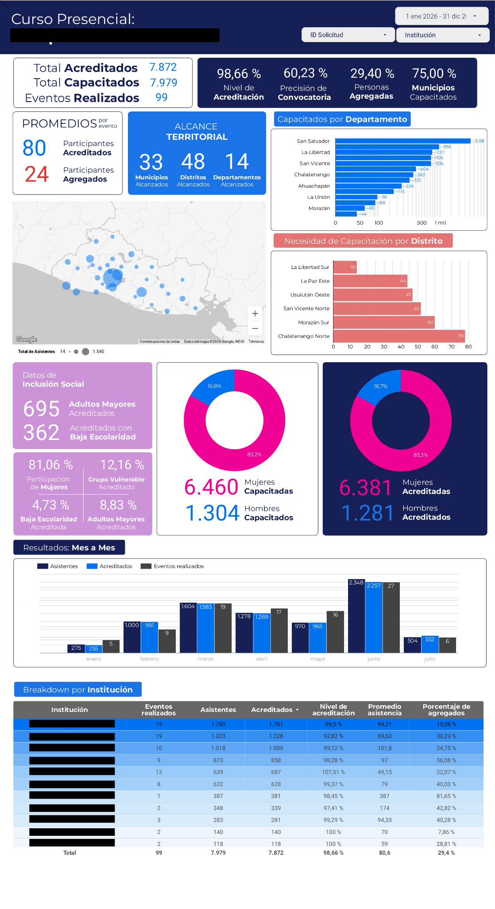

# Training Events Performance Dashboard
Interactive Looker Studio dashboard for monitoring training events, KPIs, and operational performance.

## Project Summary

**Industry:** Public Sector

**Tool:** Looker Studio

**Dataset:** Google Sheets

**Focus:** Business Intelligence

**Skills:** Dashboard Design, KPI Development, Data Validation, Data Visualization

## An overview of the project

This project consists of an interactive dashboard developed in Looker Studio to monitor the performance of institutional training events across the country.

The solution enables stakeholders to monitor training performance, territorial coverage, participant demographics, accreditation rates, and other operational indicators through a centralized dashboard, supporting data-driven decision-making.

## The business problem

The institution conducts training events across multiple locations, generating operational data from different trainers and training sessions.

Without a centralized reporting solution, monitoring participation, accreditation rates, territorial coverage, and institutional performance required manual data consolidation, making the process time-consuming and limiting timely decision-making.

The objective of this project was to transform dispersed operational data into a centralized Business Intelligence dashboard that provides real-time visibility into training performance through standardized KPIs and interactive visualizations.

## My role in creating a solution

Designed and developed this Business Intelligence solution, including data preparation, KPI definition, data validation, and interactive dashboard development in Looker Studio.

My responsibilities also included supporting data quality processes, establishing reporting standards, and ensuring that the dashboard provided reliable operational insights for stakeholders.

## Where does the data come from? 

The reporting solution integrates operational data collected through Google Sheets after each training event.

Primary data included:

- Participant information
- Training event details
- Geographic information
- Accreditation results
- Attendance records
- Information about participating institutions

## Data preparation phase

Operational data submitted after each training event was validated and standardized to ensure consistency across records before being used for reporting.

The preparation process included reviewing data completeness, validating key fields, standardizing categorical values, and ensuring data quality to support reliable KPI calculations and accurate dashboard visualizations.

This process helped maintain consistent reporting as new training events were continuously incorporated into the dashboard.

## KPI Design

The solution was designed around key performance indicators (KPIs) that provide stakeholders with a comprehensive view of training activities and their outcomes.

Some of the primary KPIs include:

- Total Training Events
- Total Participants
- Accredited Participants
- Accreditation Rate
- Average Participants per Event
- Territorial Coverage

These metrics were selected to support operational monitoring, evaluate training effectiveness, and identify trends that could inform future planning and resource allocation.

## Dashboard Design and Layout

The dashboard was designed to prioritize executive KPIs at the top, followed by geographic coverage, operational performance, demographic insights, temporal trends, and detailed institutional breakdowns.

This layout enables stakeholders to move from high-level indicators to detailed operational analysis while maintaining an intuitive navigation flow.

## A Walkthrough

### Executive Summary

The first section provides a high-level overview of the most relevant KPIs, allowing stakeholders to quickly assess overall training performance.

### Geographic Coverage

An interactive map displays the distribution of training events across the country, helping identify regional coverage and participation trends.

### Monthly Performance

Time-series visualizations highlight monthly variations in participant attendance and accreditation rates.

### Institutional Performance

Comparative charts allow users to analyze the performance of different institutions and training programs.

### Participant Demographics

Breakdowns by gender and other demographic variables provide additional context for evaluating outreach and inclusion.

## Technologies Used

- **Looker Studio** — Dashboard development and data visualization.
- **Google Sheets** — Operational data source and data management.
- **SQL** — Basic calculated fields and reporting logic.

## My key learnings

This project strengthened my understanding of dashboard design, KPI development, and data quality processes.

It also reinforced the importance of data standardization and validation to ensure reliable reporting, while improving my ability to transform operational data into actionable business insights.

## Challenges

Some of the challenges addressed during this project included:

- Maintaining consistent data quality across multiple contributors.
- Standardizing categorical values entered manually.
- Designing visualizations that balanced detail with readability.
